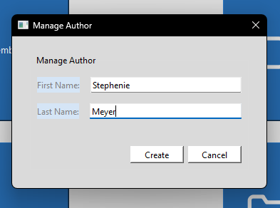
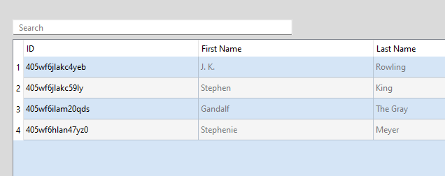
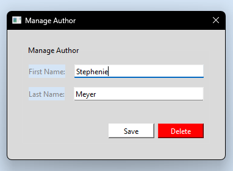

# Managing authors

- [Go back](./README.md#admin-menu)

## Create a new author

When on the Admin menu, press on the "Add Author" button, once clicked a dialog box will appear.

Enter the author's first and last names, then press the "Create" button.

## Edit or delete an existing author

When on the Admin menu, click on the "Author Search" button, upon clicking, you will be taken to the Author Search window.

Once here, press on the author you are wanting to modify, a Manage Author dialog box will appear.

### Edit author

To edit, just change any of the values you'd like, then press "Save".

### Delete author

To delete, click on the "Delete" button.
