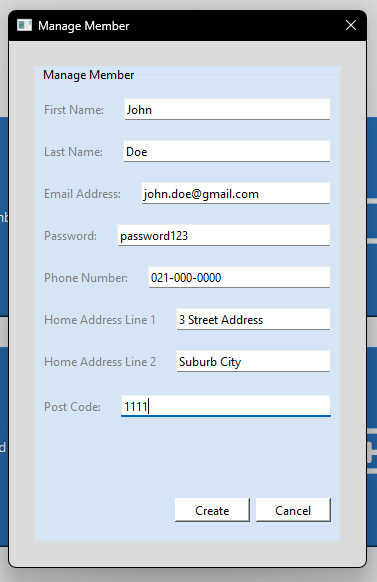
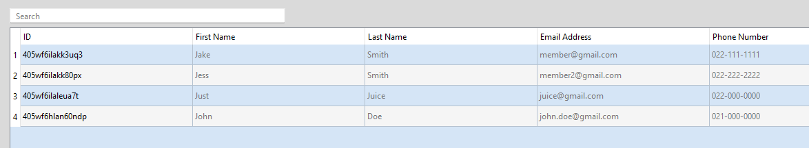
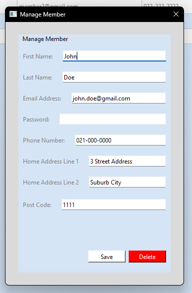

# Managing members

- [Go back](./README.md#admin-menu)

## Create a new member

When on the admin menu, press on the "Add Member" button, once clicked a dialog box will appear.

Enter the member's details, then press the "Create" button.

## Edit or delete an existing member

When on the Admin menu, click on the "member Search" button, upon clicking, you will be taken to the member search window.

Once here, press on the member you are wanting to modify, a manage member dialog box will appear.

### Edit member

To edit, just change any of the values you'd like, then press "Save".

### Delete member

To delete, click on the "Delete" button.
