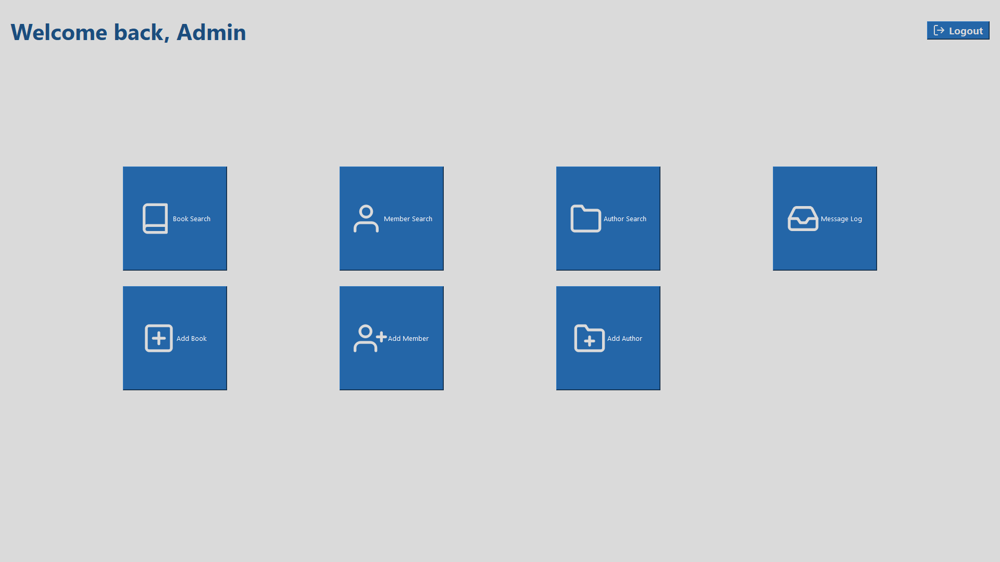

# Admin

- [Go back](../README.md)

## Table of contents

- [Managing authors](./AUTHORS.md#managing-authors)
  - [Create a new author](./AUTHORS.md#create-a-new-author)
  - [Edit or delete an existing author](./AUTHORS.md#edit-or-delete-an-existing-author)
- [Managing books](./BOOKS.md#managing-books)
  - [Create a new book](./BOOKS.md#create-a-new-book)
  - [Edit or delete an existing book](./BOOKS.md#edit-or-delete-an-existing-book)
- [Managing members](./MEMBERS.md#managing-members)
  - [Create a new member](./MEMBERS.md#create-a-new-member)
  - [Edit or delete an existing member](./MEMBERS.md#edit-or-delete-an-existing-member)

## Admin window

