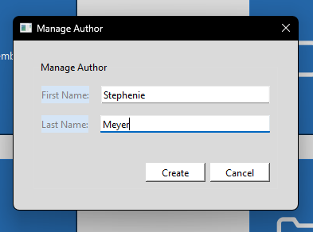
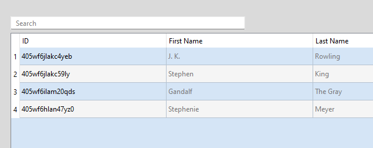
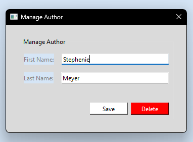
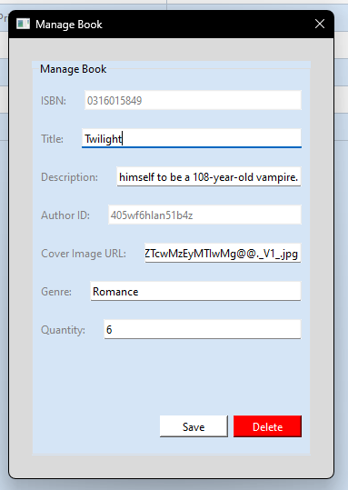

# Admin Menu

<!-- TODO: Add contents table -->

## Create a new author

When on the Admin menu, press on the "Add Author" button, once clicked a dialog box will appear.

Enter the author's first and last names, then press the "Create" button.

## Edit or delete an existing author

When on the Admin menu, click on the "Author Search" button, upon clicking, you will be taken to the Author Search window.

Once here, press on the author you are wanting to modify, a Manage Author dialog box will appear.

### Edit author

To edit, just change any of the values you'd like, then press "Save".

### Delete author

To delete, click on the "Delete" button.

## Creating a new book

Before you create a new book, you must first [create its author](#create-a-new-author), remember the authors ID.

Go to the Admin menu, then click on the "Add Book" button, once clicked, a dialog box will appear.

Enter the book's details, then press "Create".

## Edit or delete an existing book

When on the Admin menu, click on the "Book Search" button, upon clicking, you will be taken to the Book Search window.

Once there, press on the book you are wanting to modify, a Manage Book dialog box will appear.

### Edit book

To edit, just change any of the values you'd like, then press "Save".

### Delete book

To delete, click on the "Delete" button.
