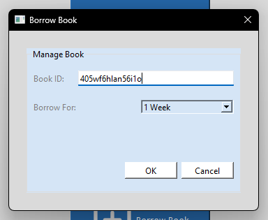
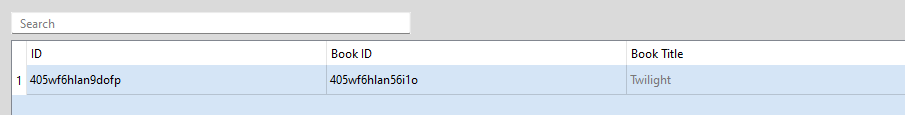
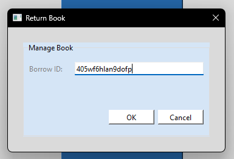

# Managing borrows

- [Go back](./README.md#member-menu)

## Borrowing a book

When on the member menu, click on the "Borrow Book" button. A dialog box will appear.

Enter the book's ID, amount of time, then press the "OK" button.

## Viewing your own borrows

To view your currently borrowed books, from the member menu, press on the "My Books" button. You will be taken to your books window.

## Returning a book

From the member menu, press on the "Return Book" button. A dialog box will appear.

Enter the **borrow ID**, then press "OK".
