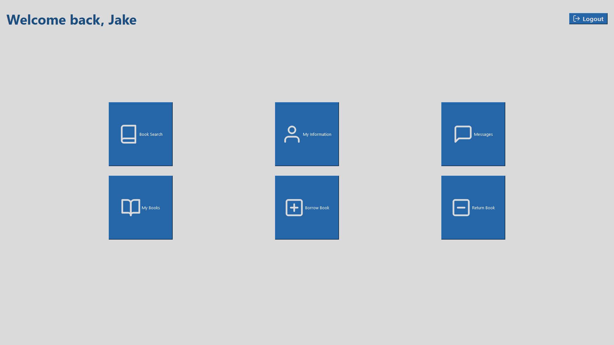

# Member Menu

- [Go back](../README.md)

## Table of contents

- [Managing authors](./MANAGE_AUTHOR.md#managing-authors)
  - [Create a new author](./MANAGE_AUTHOR.md#create-a-new-author)
  - [Edit or delete an existing author](./MANAGE_AUTHOR.md#edit-or-delete-an-existing-author)
- [Managing books](./MANAGE_BOOK.md#managing-books)
  - [Create a new book](./MANAGE_BOOK.md#create-a-new-book)
  - [Edit or delete an existing book](./MANAGE_BOOK.md#edit-or-delete-an-existing-book)
- [Managing members](./MANAGE_MEMBER.md#managing-members)
  - [Create a new member](./MANAGE_MEMBER.md#create-a-new-member)
  - [Edit or delete an existing member](./MANAGE_MEMBER.md#edit-or-delete-an-existing-member)

